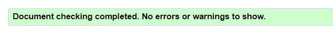
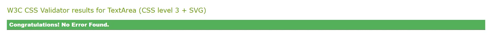
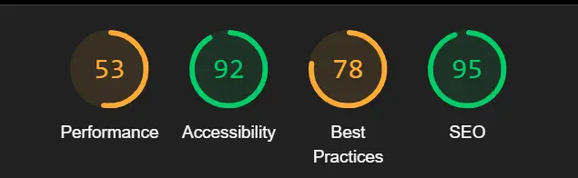

# Testing

## Manual Testing
Manual testing was completed by myself as I developed the project, making sure I manually tested each component as it was added, I used Google Chrome Devtools to view the code from the browser alongside the rendered site.

Once I had the full functionality up and running, I asked friends family and my Code Institute cohort to use the site as much as possible to see whether there were any UX ommissions or components that didn't work as they would expect as a real life user.

## User Stories
The below tables detail the paths I followed on the site to test each of the user stories, also documented with screenshots of the components and location on the site.

### First Time (Unregistered) User

|                                                                       Story                                                                        | Site Path | Images |
| :------------------------------------------------------------------------------------------------------------------------------------------------: | :-------: | :---: |
|See a consistent and easily accessible navigation menu with access to all applicable parts of the site.|From the home page, click on hamburger icon in top left of the screen||
|Be able to view products, filtered and sorted to my needs, including further details of each product.|From the home page, click on the hamburger menu icon, select product category/subcategory, brand, enter a search term or view all products. Select a sort term from the dropdown on the right of the screen, click an item image or name to view details||
|See updates from the site, including offers, new products and other news.|From the home page, view the carousel or updates, click/swipe to change slide||
|Be prompted to register to the site, finding an accessbile registration page.|From the home page, review the register button under the about information/click the hamburger menu icon to see consistent register link. Click either to view register form with fields and applicable labels, clearly marked button to submit the form, feedback on incorrect submission||
|Be able to add products to a basket, update or remove if needed.|From a product detail screen, click +/- buttons to select the desired quantity, click add to basket button to see confirmation toast and updated quantity icon on basket icon. Click basket icon to view basket, click +/- buttons and update link to update quantity in basket, click remove link and confirm in modal to remove item. ||
|Checkout quickly and simply as a guest user.|With items in basket, click basket icon in top right, review items in basket, click checkout button, fill in details and click confirm button, review order confirmation screen ||

### Registered User

|                                                                       Story                                                                        | Site Path | Images |
| :------------------------------------------------------------------------------------------------------------------------------------------------: | :-------: | :---: |
|Be able to find a sign in page that makes returning to the site quick and simple.|From the home page, click the hamburger menu icon in the top left, click sign in link, fill in form and submit to sign in with confirmation of sign in success||
|Be able to like products with a click and see feedback to denote my liked products on the product page.|From the product page, click grey heart outline icon in top left of product card, review item now shows a pink heart, click to turn the heart back to grey outline. Add likes to products to review next story. ||
|See my details on a profile page, including personal, saved shipping information, previous orders and wish list items.|From any page, select hamburger menu icon in top left, select profile link, review details, order history and wish list items. Click order number to open order and view line items||
|Be able to update my details from the profile page, including removing liked products from my wishlist.|On profile page, click heart icon on product card in wish list to remove from list, change details and click update button to save details||
|Checkout, either adding or retrieving saved details from my profile.|With items in basket, click basket icon in top right, review items in basket, click checkout button, review details pulled from profile or input details, click save info box and complete order. Navigate to profile to review updated information||

### Site Admin

|                                                                       Story                                                                        | Site Path | Images |
| :------------------------------------------------------------------------------------------------------------------------------------------------: | :-------: | :---: |
|Find options to edit site contents in the menu/profile.|From any page, click hamburger menu icon, click admin option and review admin options, click add products or add post option, input item details and click submit button||
|Be able to update products from the site interface.|Click pencil edit icon from any product card or product details page, fill in updated information on the form and click submit button||
|Be able to update posts from the site interface.|Click pencil edit icon at the bottom of the post carousel slide, fill in updated information on the form and click submit button||
|Be able to delete products or posts from the site interface.|Click trash can delete icon at the bottom of the post carousel slide or on the product card/product details page, confirm with the confirm button on the modal||
|Have a link to access the django admin panel.|From any page, click the hamburger menu icon, click store admin option and admin panel link||

## Code Testing

### HTML

I used [W3 HTML Validator](https://validator.w3.org/) to validate all HTML files by URI, pasting each page into the address bar and checking to ensure no errors were found.

### CSS

I used [W3 CSS Validator](https://jigsaw.w3.org/css-validator/validator) to validate the style.css file and received no errors.

### JS

I used [JS Hint](https://jshint.com/) to validate my JavaScript code on all .js files within the project. I needed to start my files with `/*jshint esversion: 6 */` to make sure jshint would treat the code by the standards of ES6. Noted as warning were the use of vars and referenced out of scope. As this was from the walkthrough project and updating them to lets also threw a jshint error, I made the decision to keep them as vars to match the walkthrough.

### Python

I used the Code Institute [Python Linter](https://pep8ci.herokuapp.com/) to validate my python code in all files. A few warnings were noted with lines being too long so these were amended with explicit line breaks put into the expressions. All files passed with no warnings after this.

## Lighthouse

I used the Lighthouse feature of Google Dev Tools to assess the scores of the site pages. I had issues with the performance scores of my site but compared with other MS4 projects and the boutique ado walkthrough they showed similar so this could just be down to slower internet causing a longer load time on my device. There was also a reduced score on best practices which was noted down to the cookies in use by Stripe.

[Return to README](README.md)
