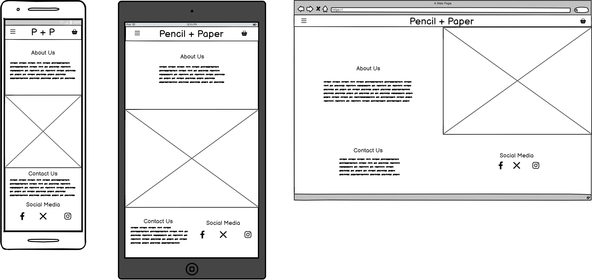
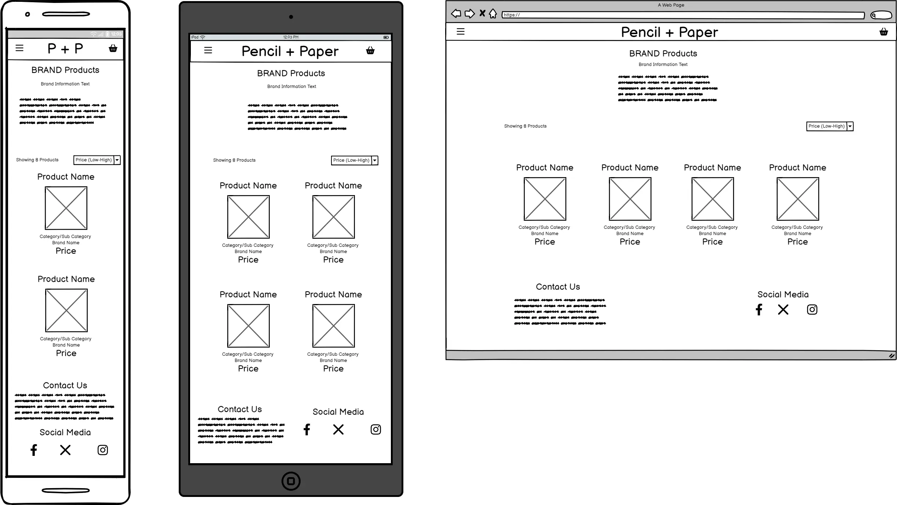

# Wireframes

Prior to developing the site, I created wireframes for all of the planned pages using [Balsamiq](https://balsamiq.com/). Below is each page from a mobile, tablet and desktop view. 

## Home

## Product

## Product (Filtered by Brand)

## Product Detail

## Basket

## Checkout / Checkout Complete
This wireframe would form the basis of both the checkout page and the checkout complete/order success page with the only difference being the addition of the order number and the form being a summary of the saved information.

## Profile

## Add Product / Brand
As with the checkout pages, this wireframe would cover the add and edit pages of both products and brands using the relevant information from the views.

## Other Elements
The other two elements covered by the wireframes are the Nav Menu element which is persistent across all pages asnd the modal popup which would display to confirm the user wanted to delete something, either from their basket or an admin deleting a Post or Product.

[Return to README](README.md)